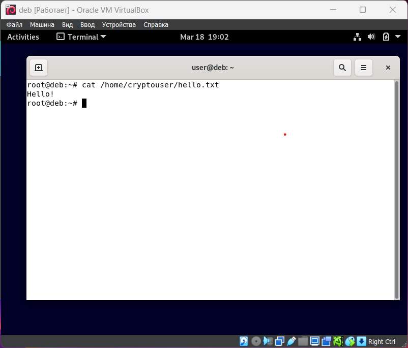
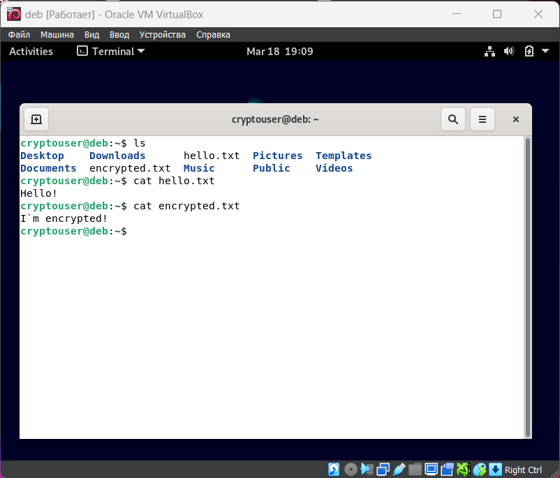
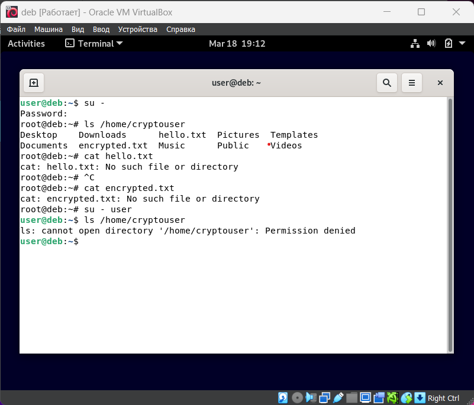
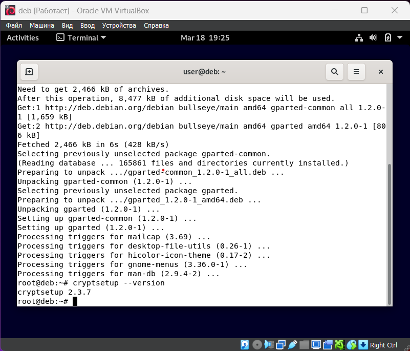
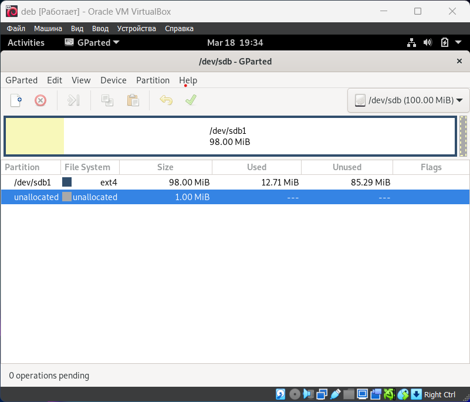
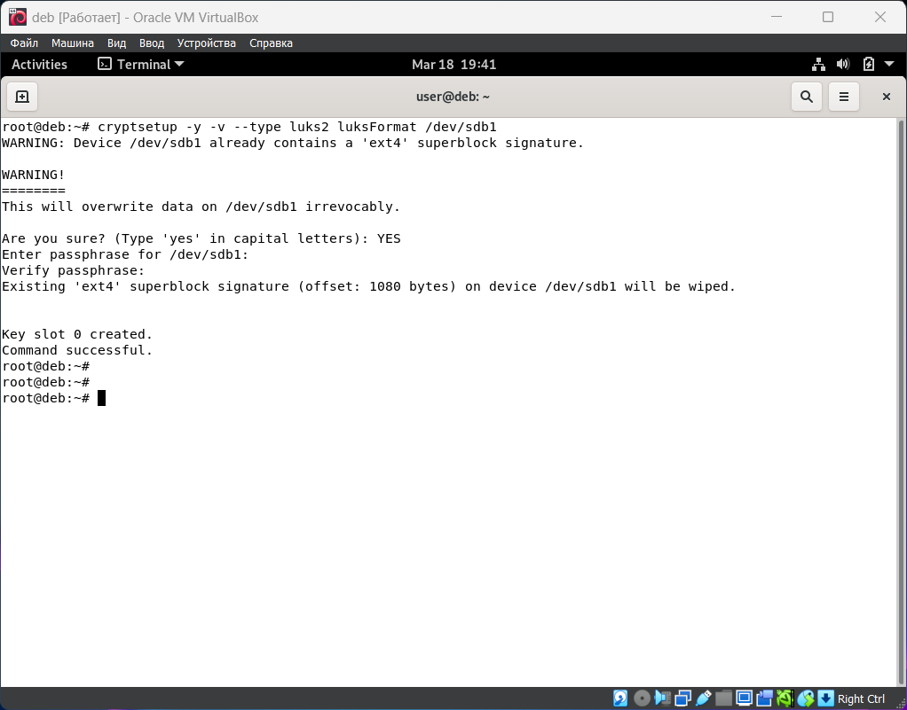
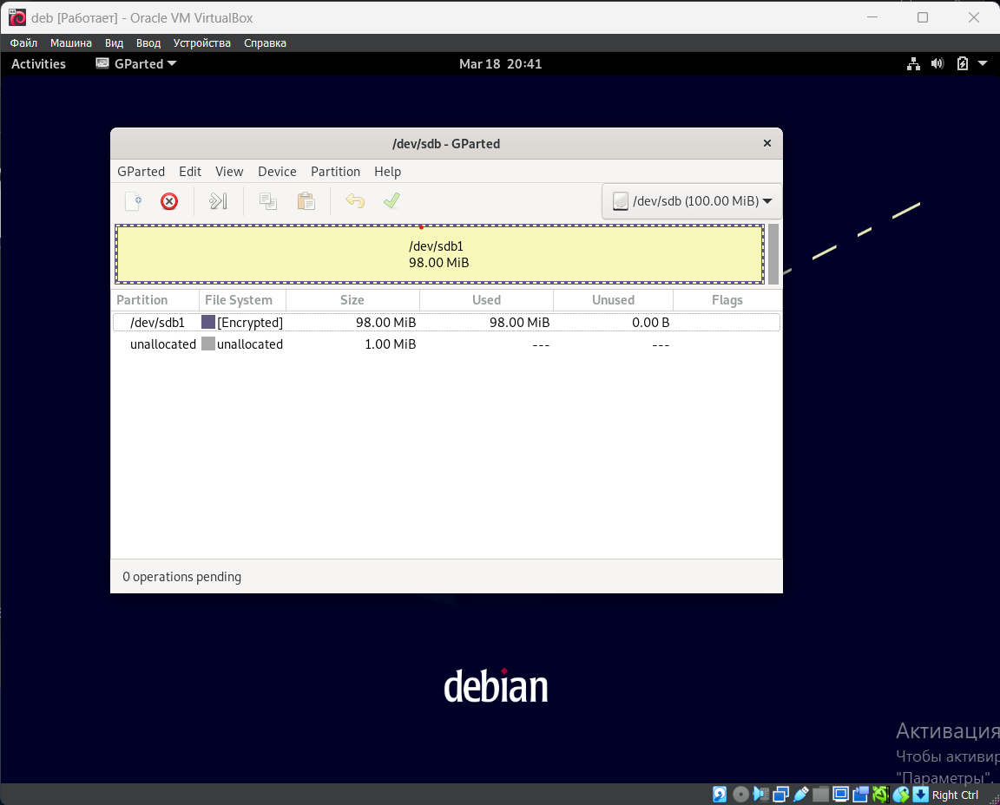
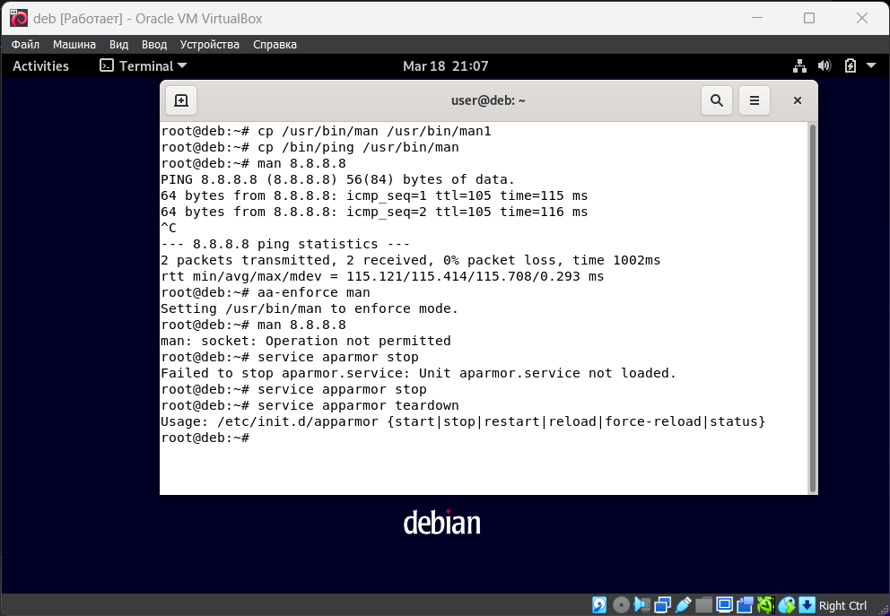

# Домашнее задание к занятию 13.2. «Защита хоста» - Александр Гумлевой

### Задание 1

1. Установите **eCryptfs**.
2. Добавьте пользователя cryptouser.
3. Зашифруйте домашний каталог пользователя с помощью eCryptfs.

*До шифрования домашней директории пользователя cryptouser его файлы доступны под root*

*cryptouser c зашифрованной домашней дерикторией*

*После шифрования домашней директории пользователя cryptouser его файлы не доступны даже под root*  

### Задание 2

1. Установите поддержку **LUKS**.
2. Создайте небольшой раздел, например, 100 Мб.
3. Зашифруйте созданный раздел с помощью LUKS.

### Задание 3 *

1. Установите **apparmor**.
2. Повторите эксперимент, указанный в лекции.
3. Отключите (удалите) apparmor.

